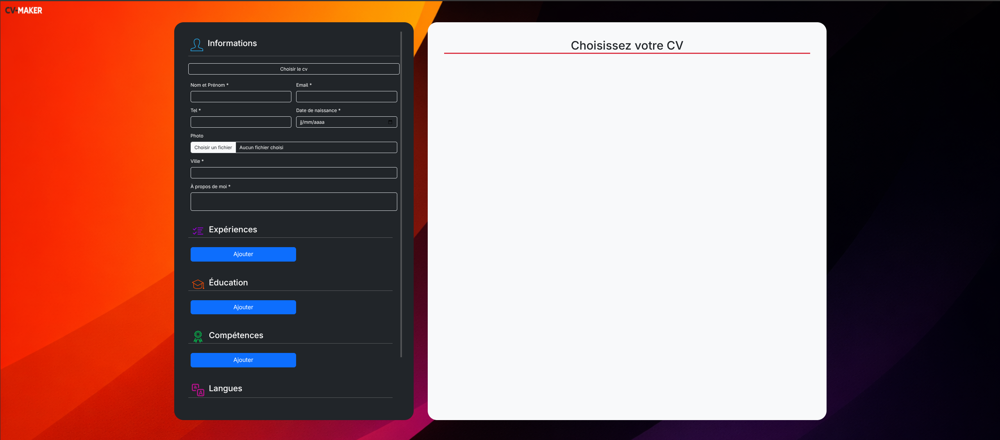
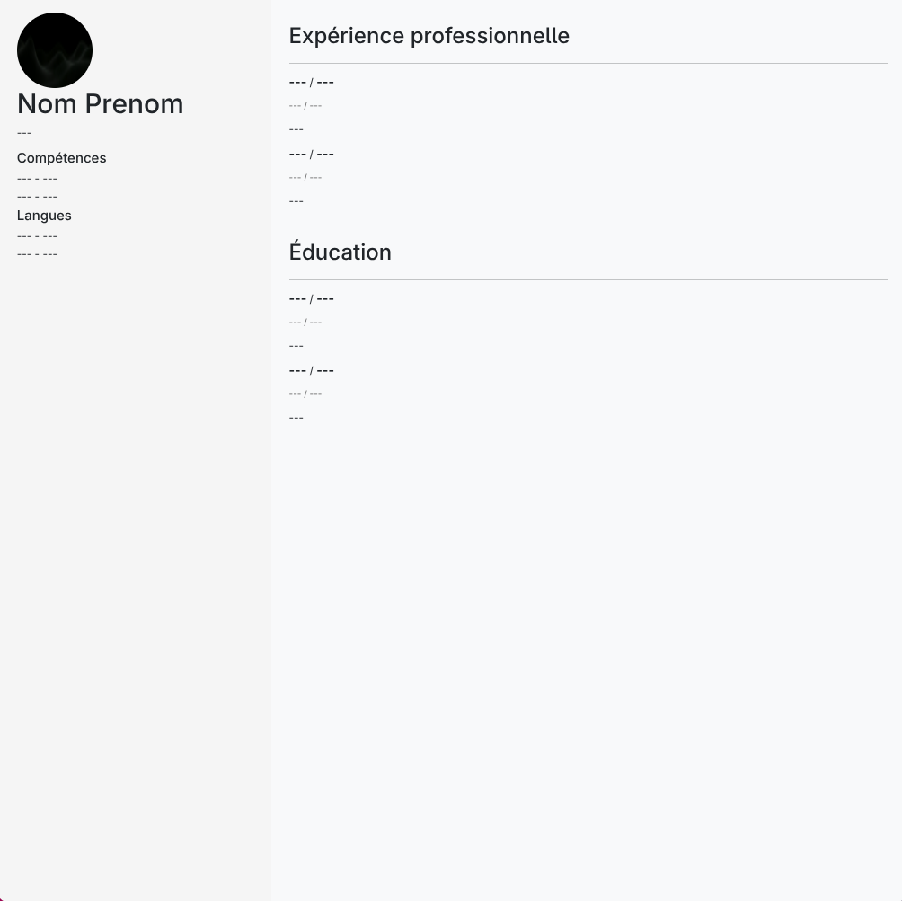

# CV MAKER

CV Maker est un générateur de CV qui propose le choix entre deux templates.

Le formulaire se compose de cinq sections :
- Informations personnelles  
- Expériences  
- Éducation  
- Compétences  
- Langues  

Tous les champs de la section **Informations personnelles**, à l’exception de la photo, sont obligatoires. La génération du CV n’est pas possible tant que ces champs ne sont pas remplis.

Les sections suivantes disposent d’un bouton **Ajouter** permettant d’ajouter dynamiquement des sections au formulaire et au CV via JavaScript. Ce dernier permet également leur suppression grâce à des identifiants uniques.

À la fin du formulaire, on retrouve un bouton **RESET** qui rafraîchit la page, ainsi qu’un bouton **« Télécharger PDF »**.  
Lors du téléchargement, JavaScript vérifie si les champs obligatoires sont remplis. Si c’est le cas, PHP exporte le CV en PDF et lance le téléchargement.

Le fichier `export.php` dispose également d’une protection contre l’injection HTML grâce à **HTMLPurifier**, installé via **Composer**.

Le CV téléchargé correspond exactement au CV prévisualisé et prend correctement en charge la photo ainsi que les caractères français.

La mise en page du site et le style du CV ont été réalisés principalement avec **Bootstrap**, à l’exception de quelques cas spécifiques comme le background.

---

## Liens

**GitHub** https://github.com/lblrs/cv-generator

**GitHub Pages** https://lblrs.github.io/cv-generator/

---

## Aperçu du projet

## Templates de CV

